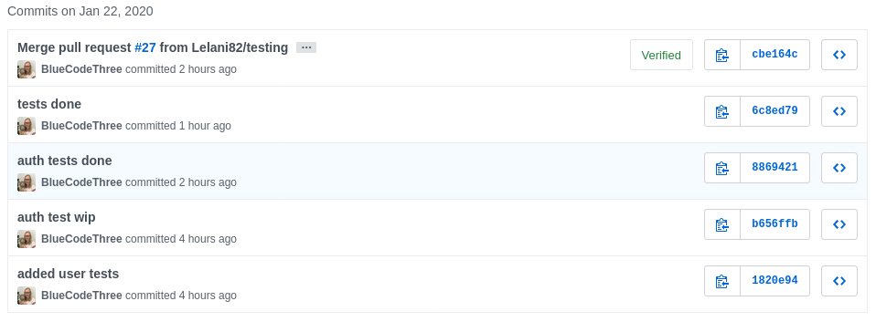
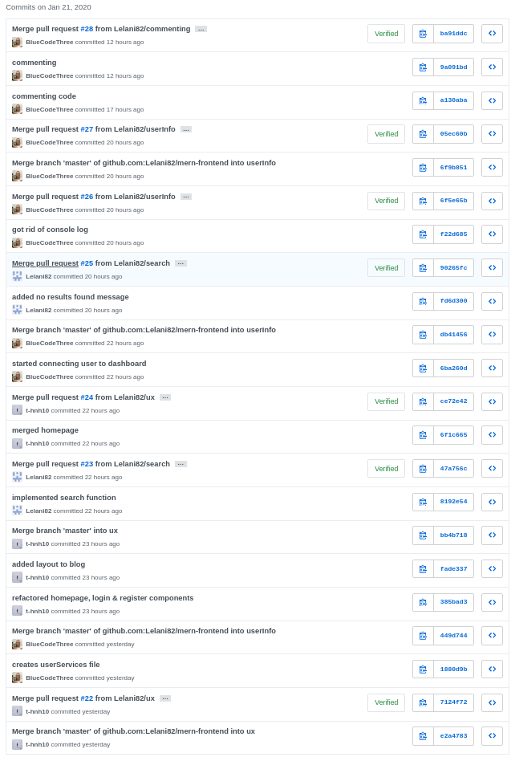
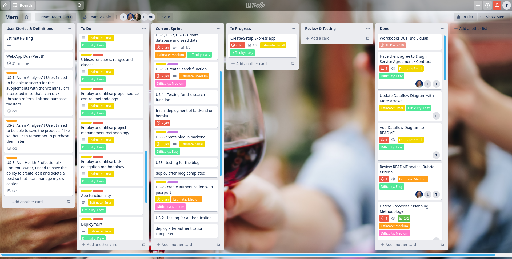
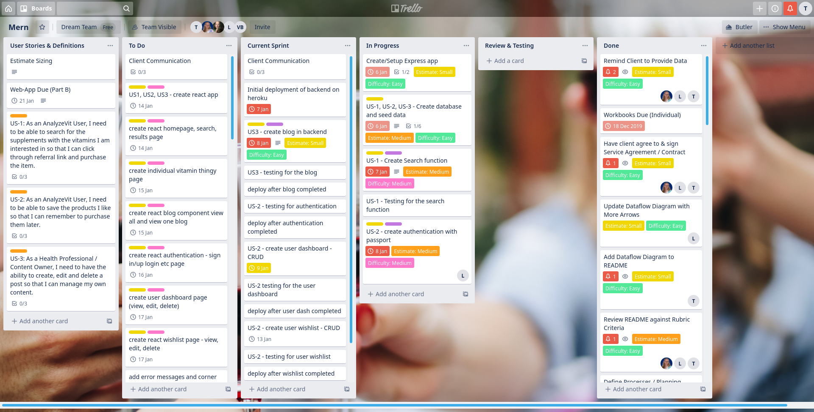
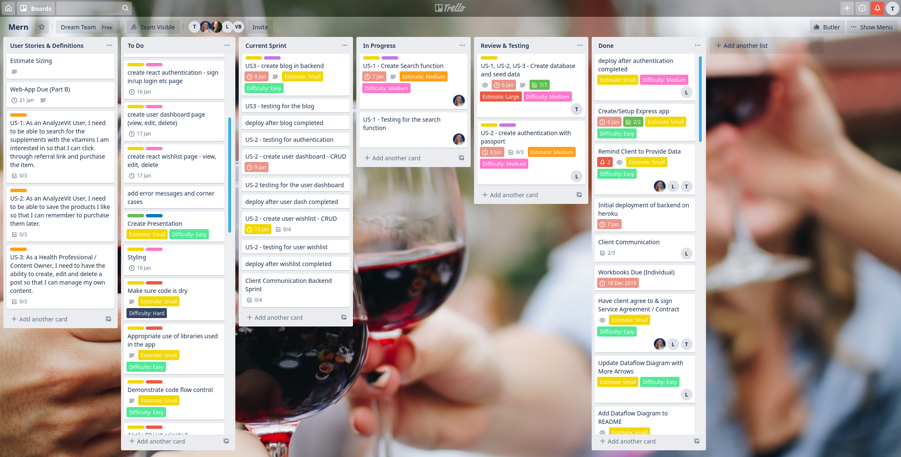
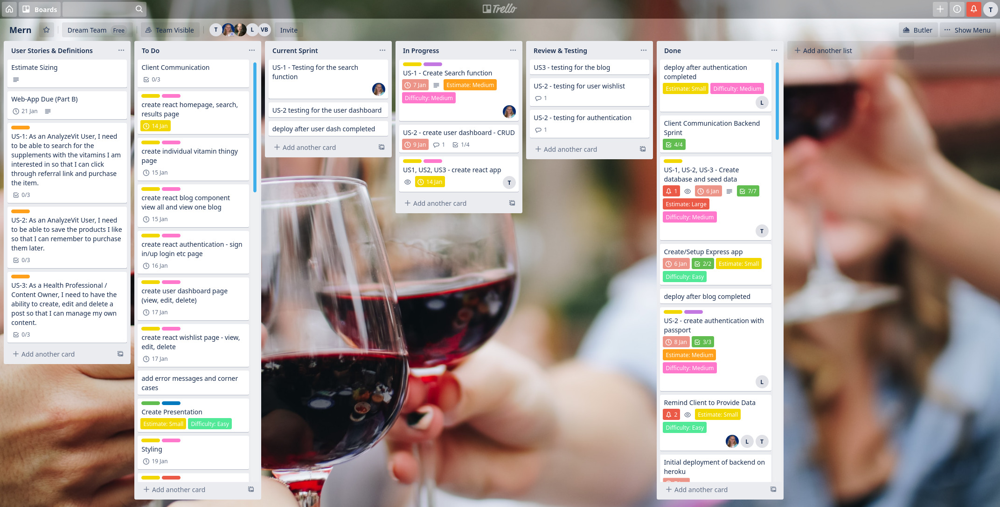
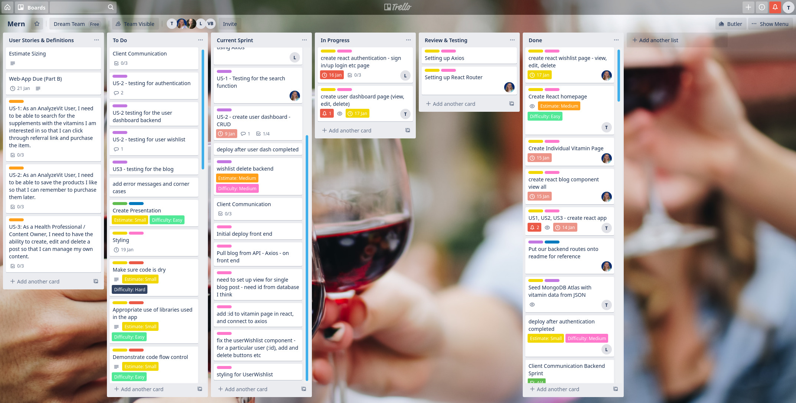
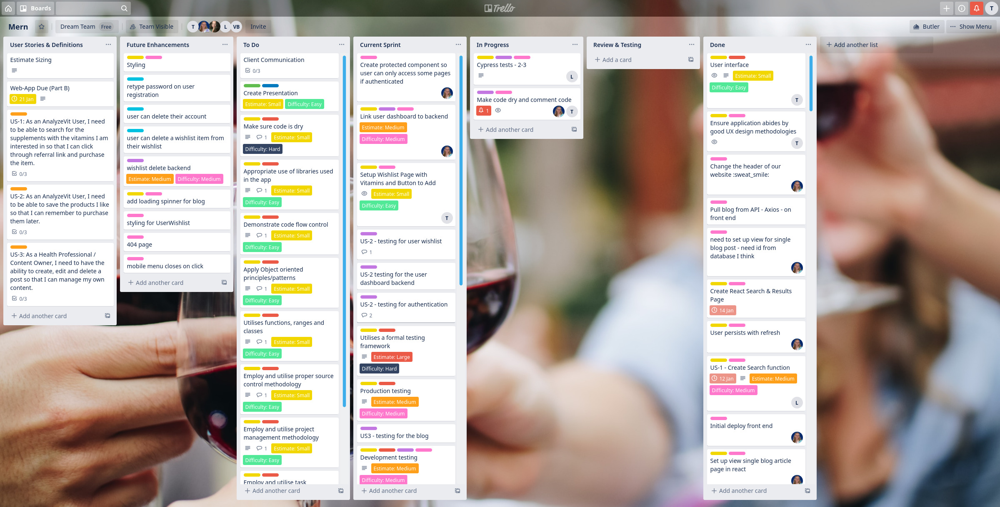
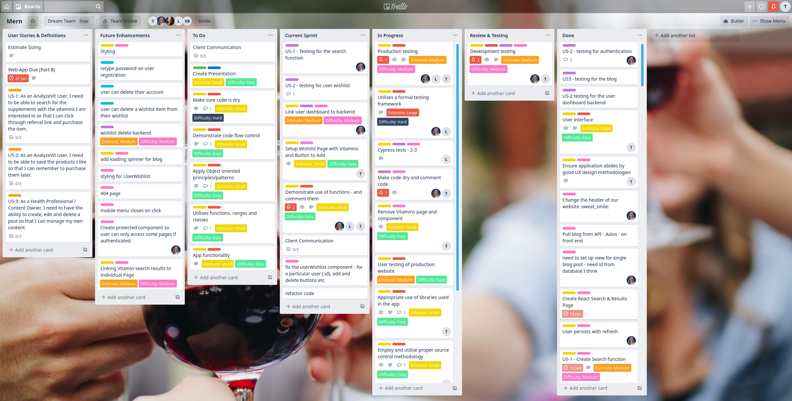

# AnalyzeVit

## Authors

* **Carlie Hamilton** – [BlueCodeThree](https://github.com/BlueCodeThree)
* **Lelani Parker** – [Lelani82](https://github.com/Lelani82)
* **Tony Huynh** – [t-hnh10](https://github.com/t-hnh10)

## Source Control Methodology

PRG1006-2.1 Employ and utilise proper source control methodology

The source control methodology adopted in this project was the Feature Branch Workflow. This workflow can be encapsulated in the idea that all feature development should take place in a dedicated branch instead of the `master` branch. This arrangement allows for easier collaboration between multiple developers to work on particular features of the application without disturbing the main codebase. Thus, minimising the potential for onerous merge conflicts.

Below is an example of the regular and frequent commits as executed by the team.

Following the completion of work on dedicated branches, team members demonstrated their exceptional capabilities in employing the Feature Branch Workflow by carrying out pull requests, reviewing other members' work and merging changes to `master` branch.

## Project Management Methodology

PRG1006-2.2 Employ and utilise project management methodology

Slack was the main point of communication between the team members. Where certain team members faced difficulties regarding personal and professional matters, such matters would be communicated via Slack and other team members would be delegated and assume various tasks. In assisting fellow members, the team was able to commit to the project timeline as outlined in the planning stages.

See below for evidence of communication.

The team used a Kanban board for task delegation, with tickets assigned to team members taking into consideration the member's strengths and weaknesses. A robust labelling system was used in order to categorise tasks; these included `Part A`, `Part B`, `User Story`, `Criteria Check`, `BackEnd`, `FrontEnd`, `README`, & `Future Enhancement`.

Below are screenshots of the Trello board, taken after major work had been completed.

7 December 2019

8 December 2019

13 January 2020

14 January 2020

17 January 2020

21 January 2020

22 January 2020

## Task Delegation Methodology

PRG1006-2.3 Employ and utilise task delegation methodology

The methodology used in this project was the Kanban methodology, a framework allowing us to implement Agile software development while benefitting from planning flexibility, shortened time cycles, fewer bottlenecks and continuous delivery.

The team established, agreed to, and adhered to the following standards.

### Cadence

There was a continuous flow in which there were no fixed time sprints to allow for flexible time management. This meant that we were free to spend more time on the server-side application and continually refactor, as opposed to spending an equal amount of time on both the server and client.

6.0 to >5.0 pts
HD
Simple and clear standards for planning methodology chosen and adhered to