# AnalyzeVit

## Authors

* **Carlie Hamilton** – [BlueCodeThree](https://github.com/BlueCodeThree)
* **Lelani Parker** – [Lelani82](https://github.com/Lelani82)
* **Tony Huynh** – [t-hnh10](https://github.com/t-hnh10)

## Libraries Used

CMP1043-1.3 Appropriate use of libraries used in the app

### Axios

Axios is a lightweight HTTP client based on the $http service in Angular.js and similar to the Fetch API. It allows us to take advantage of `async` and `await` because it is promise-based, this leads to more readable asynchronous code. It also allows us to intercept and cancel requests. Cross site request forgery can also be prevented using Axios as there is built-in client side protection.

### React-bulma-components

React components for Bulma allows for the implementation of the Bulma framework, compatible with most used React Frameworks, such as Gatsby, CRA, and Next.js. By using Bulma, the development team avoided the need to manually style the website with CSS. Thereby saving time and improving project management efficiency.

### React Router

React Router is a collection of navigational components that compose declaratively within our application. This standard routing library manages the URLs, allowing us to implement navigation through the React application with multiple views.

### Chai

Chai is an assertion library that helps us write tests in a more readable manner.

### Cross-Origin Resource Sharing

Cross-Origin Resource Sharing (CORS) is a mechanism that uses additional HTTP headers to tell browsers to give a web application running at one origin, access to selected resources from a different origin.

### Express

Express is a minimal and flexible Node.js web application framework that provides several features for web applications. Included in it are a myriad of HTTP utility methods and middleware, allowing us to create robust APIs quickly and easily.

### Jest

Jest is a library for testing JavaScript code. For this project, Jest was used to test the server-side back end.

### Mocha

Mocha is a JavaScript test framework running on Node.js, allowing for easy asynchronous testing. Mocha was used to test the client front end in this project.

### Mongoose

Mongoose provides a straight-forward, schema-based solution to model our application data. It includes built-in type casting, validation, query building, and business logic hooks.

### Passport

Passport is authentication middleware for Node, serving the purpose of authenticating requests. When writing modules, encapsulation is a virtue, so Passport delegates all other functionality to the application.

### Nodemon

Nodemon is a utility that monitors any changes in our source and automatically restarts the server. This has allowed us to save time by avoiding the need to have to continually refresh the server.

## Source Control Methodology

PRG1006-2.1 Employ and utilise proper source control methodology

The source control methodology adopted in this project was the Feature Branch Workflow. This workflow can be encapsulated in the idea that all feature development should take place in a dedicated branch instead of the `master` branch. This arrangement allows for easier collaboration between multiple developers to work on particular features of the application without disturbing the main codebase. Thus, minimising the potential for onerous merge conflicts.

Below is an example of the regular and frequent commits as executed by the team.

Following the completion of work on dedicated branches, team members demonstrated their exceptional capabilities in employing the Feature Branch Workflow by carrying out pull requests, reviewing other members' work and merging changes to `master` branch.

## Project Management Methodology

PRG1006-2.2 Employ and utilise project management methodology

Slack was the main point of communication between the team members. Where certain team members faced difficulties regarding personal and professional matters, such matters would be communicated via Slack and other team members would be delegated and assume various tasks. In assisting fellow members, the team was able to commit to the project timeline as outlined in the planning stages.

See below for evidence of communication.

The team used a Kanban board for task delegation, with tickets assigned to team members taking into consideration the member's strengths and weaknesses. A robust labelling system was used in order to categorise tasks; these included `Part A`, `Part B`, `User Story`, `Criteria Check`, `BackEnd`, `FrontEnd`, `README`, & `Future Enhancement`.

Below are screenshots of the Trello board, taken after major work had been completed.

7 December 2019

8 December 2019

13 January 2020

14 January 2020

17 January 2020

21 January 2020

22 January 2020

## Task Delegation Methodology

PRG1006-2.3 Employ and utilise task delegation methodology

The methodology used in this project was the Kanban methodology, a framework allowing us to implement Agile software development while benefitting from planning flexibility, shortened time cycles, fewer bottlenecks and continuous delivery.

The team established, agreed to, and adhered to the following standards.

### Cadence

There was a continuous flow in which there were no fixed time sprints to allow for flexible time management. This meant that we were free to spend more time on the server-side application and continually refactor, as opposed to spending an equal amount of time on both the server and client.

### Release Methodology

The team committed to continuous delivery and deployed regularly as features were completed.

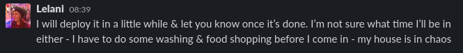

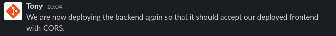

#### Netlify / Front End Client Deployment

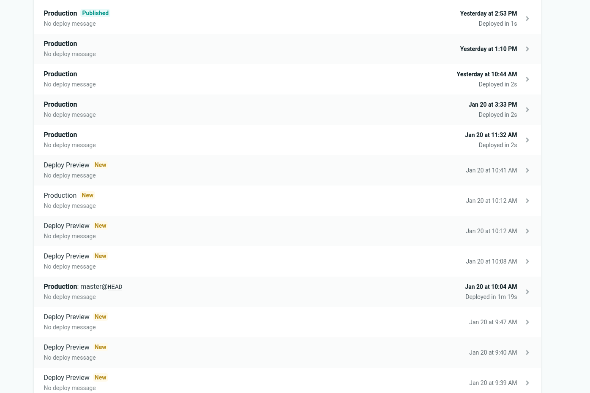

#### Heroku / Back End Deployment

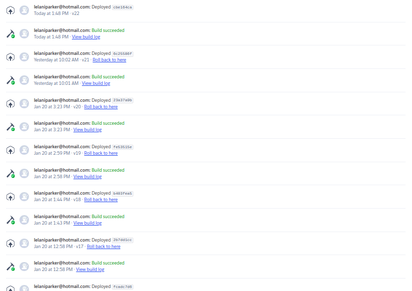
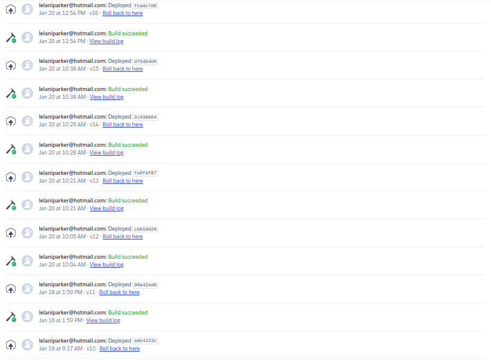
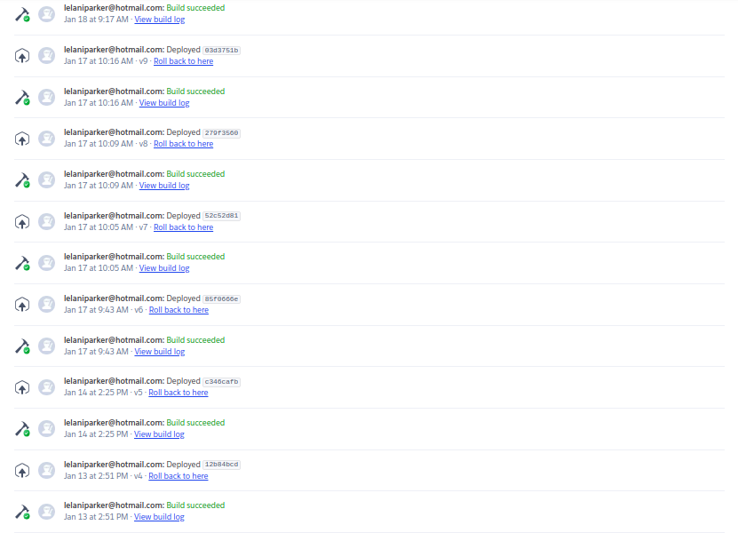
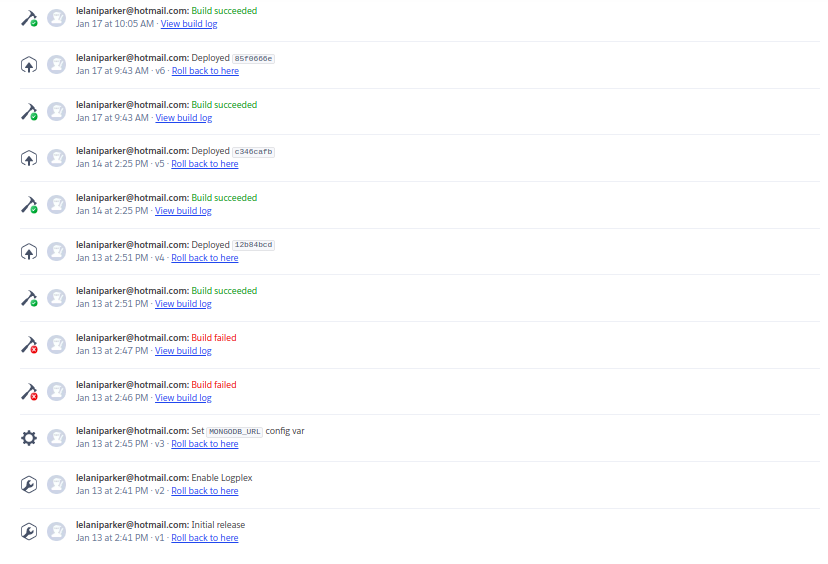

### Roles

Following the Kanban methodology, the team did not employ roles. Instead, team members worked together by pair programming and working on features individually when appropriate. Trello screenshots found above demonstrate the self-assignment of tasks that members carried out, working on features as they are required.

### Key Metrics

The standard established required at least two members to work on a task if a single team member had been working on the feature for three days and was not approaching completion. This is shown in Trello where certain cards had more than one team member designated as being responsible for that task.

### Change Philosophy

Team members had agreed to allow for change to occur at any time and that the Kanban board was to remain current throughout the project. As evidenced by the changing of cards and assignment of tasks to certain members, the team had adhered to using Trello extensively which greatly benefitted the project.

### Stand-ups

The standard required that there be at least one stand-up each working day of the development cycle. The team far exceeded this requirement by holding multiple stand-ups throughout each working day. This allowed team members to be updated on tasks others were working on, also allowing for opportunities to ask for help and provide help.

### Client Communication

The standard agreed upon stated that the team was to communicate with the client through the use of Slack. This was abided by all team members. Correspondence was to occur once a week but, due to the unfortunate timing of circumstances, our client was not always available. However, the team did succeed in contacting the client for final user testing of our end product that had been deployed.

Client Communication

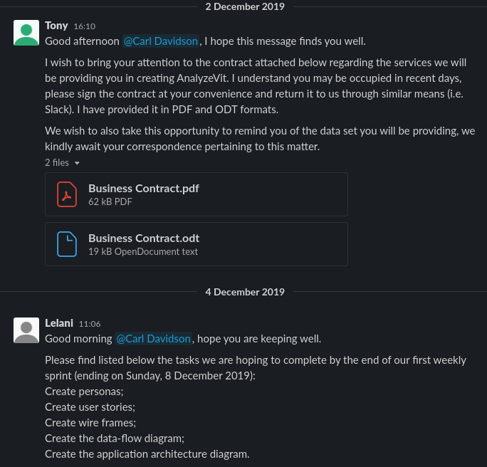
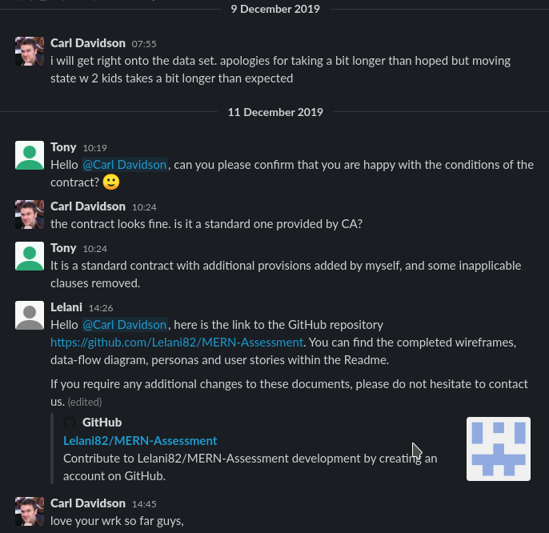
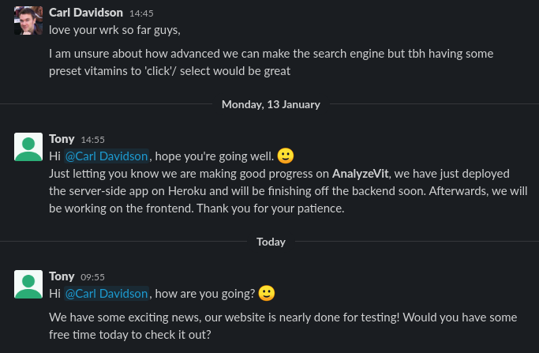

Client Feedback

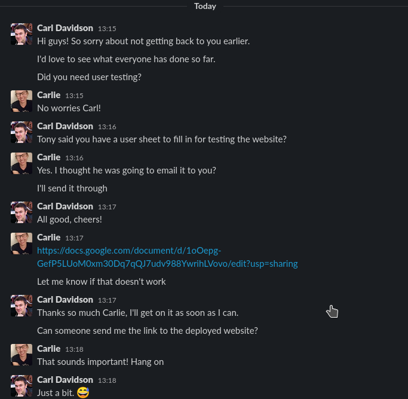
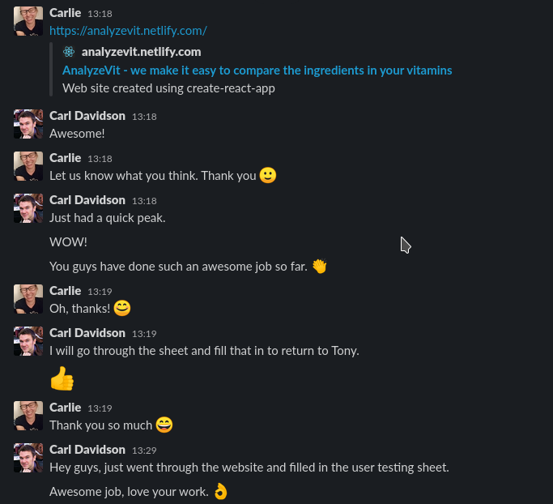
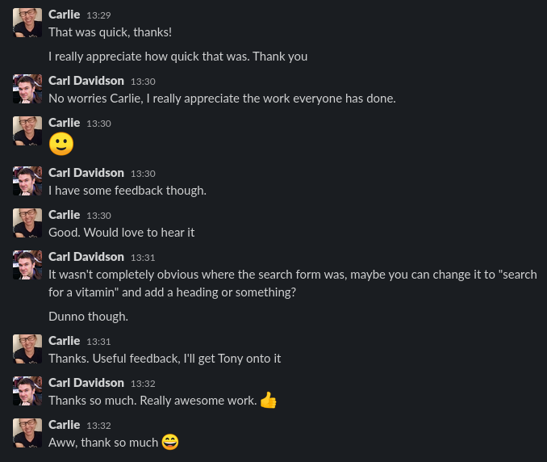

## User Testing

### Development Site

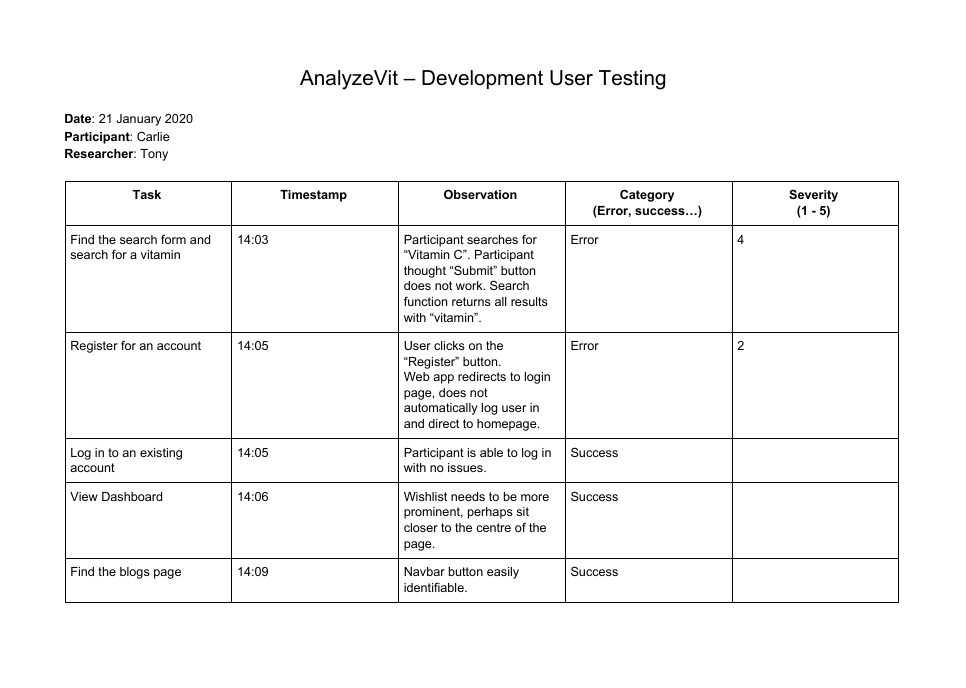
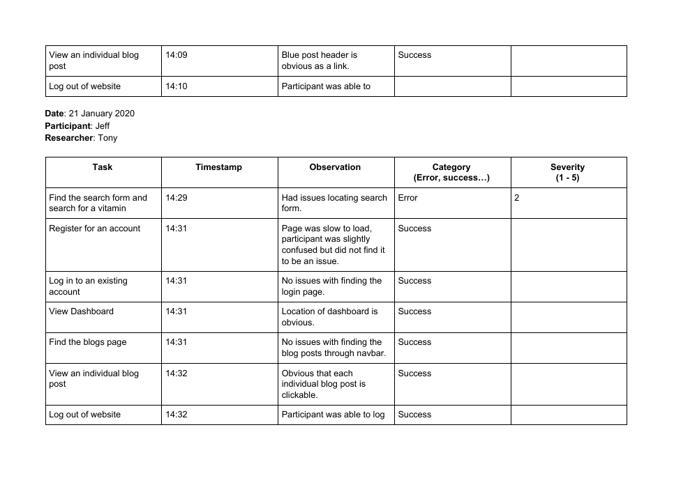
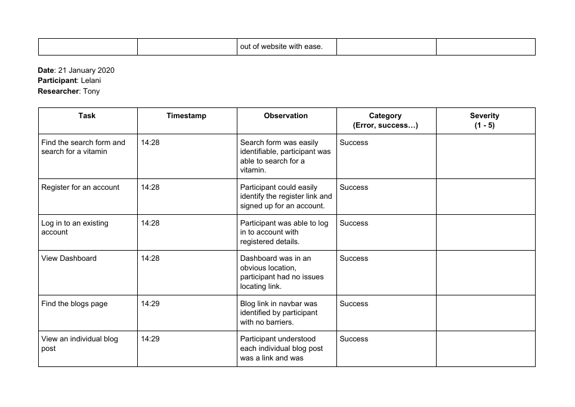
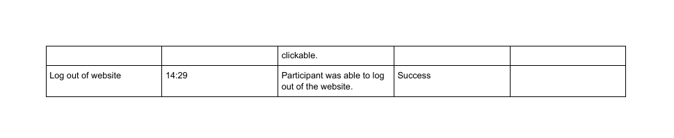

### Production Site

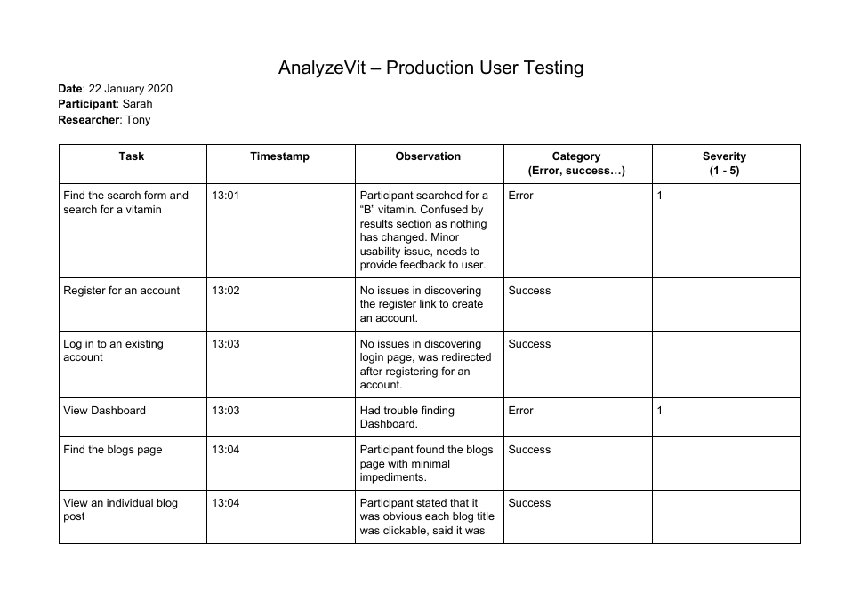
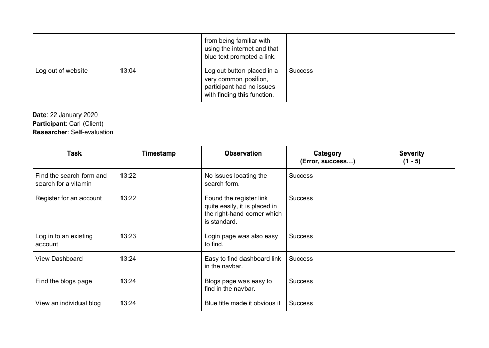
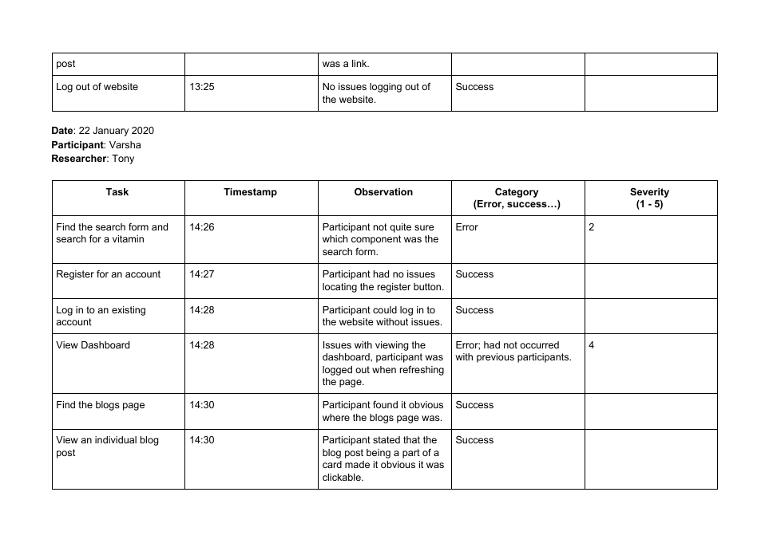
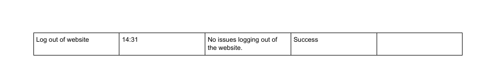